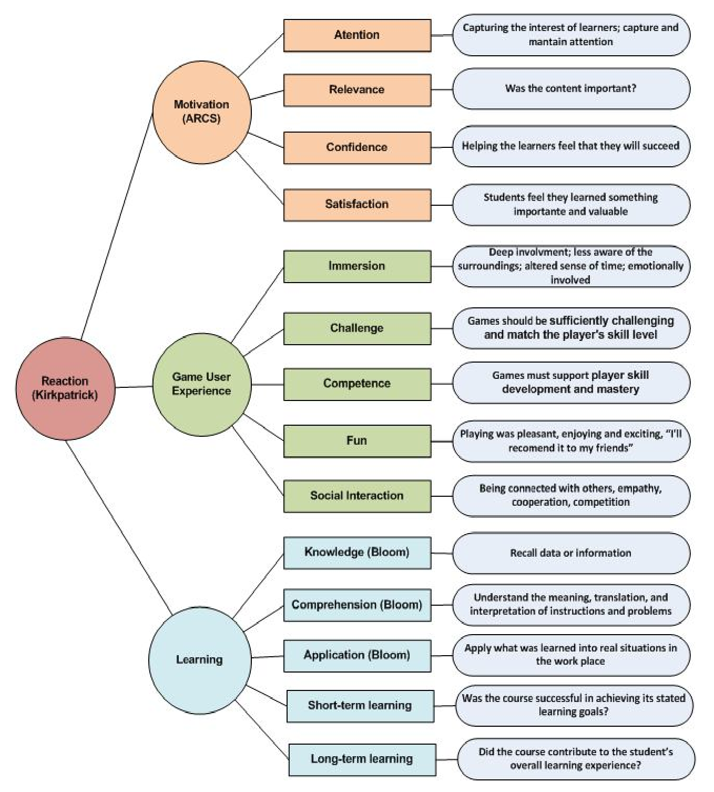

# Specification By Example for Educational Purposes

This repository details the validation process of the paper *Specification By Example for Educational Purposes* presented in the [22nd Annual Conference on Innovation and Technology in Computer Science Education : ITiCSE ](http://iticse.acm.org/) (Bologna, Italy, 3-5 July 2017).

**Abstract :**
*The [Specification By Example](https://gojko.net/books/specification-by-example/) (SBE) is a guideline for building the right software, a software that meets customer requirements. It is based on seven process patterns and enhances communication and collaboration and it usually is used in agile software development. The connection between education and agile software development sounds actually as an emergent topic. In this paper, we propose to structure a teaching approach in analogy to an agile software developement by transposing each process pattern of SBE to a corresponding one in the teaching domain. Moreover, we show that thanks to the emergence of a collective intelligence process, the students are more confident and more responsible. Such a course offers the opportunity to learn not only technical skills, but also some values in a new mindset.*

The paper will be soon available [here](http://dl.acm.org/).

In this repository, you find :

* [Overview of the paper](#overview)  

* [More details about the validation process](#detail)  
	[1. Original validation process](#originalProcess) 
 
	[2. Adapted validation process to our case study](#adaptedtProcess)  
	[---> 2.1 Revise/adapt the objective of the evaluation](#objective)    
	[---> 2.2 Revise/adapt the research](#questionnaires)  
	[---> 2.3. Plan the evaluation](#plan)  
	[---> 2.4. Execute the evaluation collecting data via questionnaire](#execution)  
	[---> 2.5. Analyze the data collected using the analysis template](#analyze)  
	[---> 2.6. Interpret the analyzed data](#interpretation)   
 
* [References related to the validation process](#references) 

##  Overview of the paper  

The Seven Patterns from SBE are described in this paper and a parallel is drawn to derive teaching patterns and practices from patterns coming from agile software development.  
Here is an big picture of this transposition. It is structured as a
[mindmap](http://www.mindmapping.com) where the root is the goal to achieve.  
The first level provides original patterns of SBE.  
The second level provides corresponding teaching-domain patterns.  
And the last level provides practices to implement the patterns.  
  

This guideline, based on Agile Software Development principles and processes, can be considered as an help to design, execute and evaluate an academic course.

The purpose of the *right* course is to enhance the individual student's capability to participate in and contribute to collaborative learning process based on collective intelligence process. 

  
A short presentation (only 4 patterns) is available [here](slides/SBEForEducationITiCSE2017only4Patterns.pdf).  
A full presentation is available [here](slides/SBEForEducationITiCSE2017full.pdf).

##  More details about the validation process  

### 1. Original validation process  

The validation process has been adapted from an original model initially presented in [[1](#deliver)] and called **Model for the Evaluation of Educational Games**.    
This model aims to assess the quality of educational games through the students' perceptions about levels of motivation, user experience and learning promoted by one game.
A brief description of this model is avalaible on **http://www.gqs.ufsc.br/wp-content/uploads/2012/02/ModelDescription-vE10.pdf**.  

Here is a big picture extracted from this document. It summarizes the dimensions focused by the model :

The model is based on two questionnaries related to [Bloom's taxonomy](https://en.wikipedia.org/wiki/Bloom's_taxonomy) of educational objectives and [Kirkpatrick](https://en.wikipedia.org/wiki/Donald_Kirkpatrick)'s levels of evaluation :

* The first questionnaire based on **Bloom Taxonomy** evaluates the perception of the evolution of learning in the competencies taught before and after the game in terms of **knowledge**, **comprehension**, **application**. Questions of this questionnaire are defined with respect to the specific instructional objective of the game. The response is relative to the perceived level of contribution of the game to the
knowledge/comprehension/application of the learner on a 4-point scale ranging from 1 – no contribution to 4 – strong contribution. 

* The second questionnaire based on **Kirkpatrick Evaluation** consists of a total of 27 items asking **motivation**, **user experience**, and **learning** through eleven dimensions (*attention, relevance, confidence, satisfaction, immersion, challenge, competence, fun, social interaction, short-term learning,* and *long-term learning*). The response format for each of these items is based on a Likert scale with response alternatives ranging from strongly disagree to strongly agree on a five points scale ranging from -2 to 2.

This original model provides a ready-to-use kit (including questionnaires, analysis spreadsheet and data analysis instructions) available [here](http://www.gqs.ufsc.br/wp-content/uploads/2012/09/kit_GameEvaluation_vE20.zip). 
The details of questionnaires can be seen [here](Questionnaire_vE10.pdf).

Such questionnaires have already been applied for several games and coding dojo session [[1](#scrumia), [2](#deliver),[3](#mockup)].

Even though we used the original version of the model, it is interesting to note that since our case study, the model has evolved to MEEGA+ (Model for Evaluating Educational Games) [[4](#MEEGA+)]. Digital game or non-digital game can now be evaluated. An evaluation kit for free for this latest release of this model is now avalaible on [http://www.gqs.ufsc.br/meega-a-model-for-evaluating-educational-games/](http://www.gqs.ufsc.br/meega-a-model-for-evaluating-educational-games/).

### 2. Adapted validation process to our case study  

The implementation of this model in our case study requires some adaptations. 
We also follow all the steps described by the [model documentation](http://www.gqs.ufsc.br/wp-content/uploads/2012/02/ModelDescription-vE10.pdf), namely :

[1. Revise/adapt the objective of the evaluation](#objective)   
[2. Revise/adapt the research](#questionnaires)  
[3. Plan the evaluation ](#plan)   
[4. Execute the evaluation collecting data via questionnaire](#execution)   
[5. Analyze the data collected using the analysis template](#analyze)  
[6. Interpret the analyzed data](#interpretation)

#### 2.1. Revise/adapt the objective of the evaluation 

A definition of quality in the context of educational game has been suggested in [[2](#scrumia)] as ***a game is high-quality, if it provides a positive learning effect, motivates students to study and provides a pleasant and engaging learning experience***.  
We choose to extend this definition to the ***right* course** whose the expectations in terms of **learning**, **collaboration**, **commitment** and **happiness** to work are similar.  
The basic hypothesis is that the right course contributes positively to achieving theses learning objectives.

#### 2.2. Revise/adapt the research 

The selected research strategy is based on the *quality* of a *right* course.

Our case study is a software product methods course given to two-year french undergraduates. This course is a part of French National Pedagogical Program (PPN), a common program to all technical colleges specialized in Computer Technology. The objective of this course is to present software development processes and we have chosen to teach agile software development.

The case study begins with the application of the treatment (course).  
Teaching resources used in this course case study are (where PBL is used for Project Based Learning) :  

| Topics                                  |     Teaching(s) resources(s)|   
| :-------------------------------------- | :---------------------------------------------------|  
| Introduction to agile development       | game (Marshmallow Challenge)                        |        
| Overview of collaborative tool          | lectures and PBL                                    |        
| Introduction to Scrum                   | game (Lego4Scrum)                                   |  
| From traditional to agile development   | lectures                                            |   
| Business Model                          | lectures and PBL (focus on Lean Canvas)             |   
| Requirements: focus on vision           | PBL (workshop and innovation games)                 |   
| Requirements: from vision to features   | PBL (impact mapping and story mapping workshops)    |   
| User Story                              | lectures and PBL and writting collaborative workshop|   
| Scrum in practice                       | collaborative simulation workshops and PBL          |  
| Tests as a core of agile developpment   | lectures, game (lego-based approach), coding dojo   |  
| Retrospective                           | PBL (workshops and innovation games)                |  

Then, questionaires are applied at the end of the course in a one-shot post-test research design in an non-intrusive way after the course completion.

For the data collection, we use an on-line questionnaires (avalaible on google form) which have been adapted from original the original evaluation model. Indeed, to focus on an entire course (a *set* of teaching resources), we need to reduce some items from original questionnaires and adapt terminology from game to course for example.

##### 2.2.1 Overview of Bloom Taxonomy Questionnaire adapted to our case study
The first questionnaire based on Bloom Taxonomy evaluates the perception of the evolution of learning in the competencies taught before and after the course. It focuses on the learning goals (*doing agile* and *being agile*) with respect to the perceived impacts (knowledge, comprehension, and application) rated on a scale from 1 to 5.

The following questions are proposed in our questionnaire :

##### Doing agile
- knowledge of doing agile before the course
- knowledge of doing agile after the course
- Comprehension of agile practices and techniques before the course 
- Comprehension of agile practices and techniques after the course
- Application of an agile development before the course
- Application of an agile development after the course

##### Being agile
- knowledge of being agile before the course
- knowledge of being agile after the course
- Comprehension of being agile before the course 
- Comprehension of being agile after the course
- Application of being agilet before the course
- Application of being agile after the course

##### 2.2.2 Overview of Kirkpatrick Evaluation adapted to our case study

The second questionnaire based on Kirkpatrick Evaluation consists in 21 items asking motivation, user experience, and learning through eleven dimensions on a Likert scale with response alternatives ranging from strongly disagree (-2) to strongly agree (2). 

The following questions are proposed in our questionnaire :

##### Sub-component: Motivation

| Level        |     Questions|   
| :------------| :---------------------------------------------------|  
| Attention    | There was something interesting in this course that captured my attention   The variation (form, content or activities, workshops, games) helped me to keep attention to the course|                                 
| Relevance    | The way the game works suits my way of learning relevance   The course content is connected to other knowledge I already had   The course content is relevant to  my expectations about agile software development   Domain experience are relevant to my interests and my needs|
| Confidence    | As I worked on activities based on more collaborative than academic practices, I felt confident that I was learning   It was easy to understand the various activities and start using it as study material| 
| Satisfaction    | I am satisfied because I know I will have opportunities to use in practice things I learned during this course|             

<!--* **Attention :**  
 - There was something interesting in this course  that captured my attention-
 - The variation (form, content or activities, workshops, games) helped me to keep attention to the course  
 

* **Relevance :**
 - The way the game works suits my way of learning relevance
 - The course content is connected to other knowledge I already had 
 - The course content is relevant to  my expectations about agile software development
 - Domain experience are relevant to my interests and my needs.

* **Confidence :**
 - As I worked on activities based on more collaborative than academic practices, I felt confident that I was learning
 - It was easy to understand the various activities and start using it as study material

* **Satisfaction :**
 - I am satisfied because I know I will have opportunities to use in practice things I learned during this course
-->

##### Sub-component: User Experience

| Level        |     Questions|   
| :------------| :---------------------------------------------------|  
| Immersion    |I was so involved in collaborative activities of this course that I didn’t notice time passing.| 
| Social Interactions |I was able to interact with others during this course.   I had fun with other people.   The course promotes moments of cooperation and/ or competition between the students.|
| Challenge |The course is properly challenging for me, the tasks are not too easy nor too difficult.   The course progresses at an adequate pace and does not become monotonous - offers new obstacles, situations or variations in its tasks.| 
| Fun |I had fun with the activities of this course   I would like to do some activities of this course again.| 
| Competences |I had positive feelings of efficiency of used learning tools during  this course.| 

<!--* **Immersion :**
 - I was so involved in collaborative activities of this course that I didn’t notice time passing.

* **Social Interactions:**
 - I was able to interact with others during this course.
 - I had fun with other people.
 - The course promotes moments of cooperation and/ or competition between the students.

* **Challenge:**
 - The course is properly challenging for me, the tasks are not too easy nor too difficult.
 - The course progresses at an adequate pace and does not become monotonous - offers new obstacles, situations or variations in its tasks.

* **Fun:**
 - I had fun with the activities of this course
 - I would like to do some activities of this course again.

* **Competences:**
 - I had positive feelings of efficiency of used learning tools during  this course.
-->

##### Sub-component: Learning

|     Questions|   
| :---------------------------------------------------| 
|This experience provided a new knowledge of doing agile in future working life.|
|This experience provided a new knowledge of being agile in future working life.|
|The various activities of this course were effective for my learning, comparing it with other activities of a traditional teaching approach.|

#### 2.3 Plan the evaluation 

The agile software project management course has been designed and delivered in the fall 2015.

Eighty two-year French undergraduates participated to this course.
All students have been selected for participation.

#### 2.4 Execute the evaluation collecting data via questionnaire 

Each student has filled the two questionnaires once at the end of the course, totalling 80 participants.  
The questionnaires are avalaible on line [here](http://unil.im/sondage3301) (in french). 

#### 2.5 Analyze the data collected using the analysis template 

To analyse the data collected, we adapted to our questionnaires the spreadsheet template for data analysis provided in the [evaluation kit]((http://www.gqs.ufsc.br/wp-content/uploads/2012/09/kit_GameEvaluation_vE20.zip)).

The collected data are also analyzed through frequency diagrams in order to identify which are the most positive and negative aspects of the game with respect to each sub-component/dimension.

##### 2.5.1 Sub-component: motivation

##### 2.5.2  Sub-component: user experience

##### 2.5.3 . Sub-component learning

<!-- #### 2.6 Interpret the analyzed data   -->

## References related to the validation process  

[1] [C. G. von Wangenheim, R. Savi, and A. F. Borgatto.  
Deliver! - an educational game for teaching earned
value management in computing courses.   
*Inf. Softw. Technol.*, 54(3):286–298, 2012](http://dl.acm.org/citation.cfm?id=2088606)  

[2] [C. G. von Wangenheim, R. Savi, and A. F. Borgatto.  
Scrumia : An educational game for teaching scrum in computing courses.  
*Journal of Systems and Software*, 86(10):2675–2687, 2013](http://www.sciencedirect.com/science/article/pii/S0164121213001295)  

[3] [B. Estácio, N. Valentim, L. Rivero, T. Conte, and R. Prikladnicki.  
Evaluating the use of pair programming and coding dojo in teaching mockups development: An empirical study.  
*In HICSS*, pages 5084–5093. IEEE Computer Society, 2015](http://dl.acm.org/citation.cfm?id=2761482)  

[4] [MEEGA+ (A Model for Evaluating Educational Games)  
developped by the Software Quality Group (GQS) of the Department of Informatics and Statistics (INE) at the Federal University of Santa Catarina (UFSC), (Brazil)         
http://www.gqs.ufsc.br/meega-a-model-for-evaluating-educational-games/](http://www.gqs.ufsc.br/meega-a-model-for-evaluating-educational-games/)  

## Comments, questions and feedbacks ...

* A question, a remark, go here : https://github.com/iblasquez/acm-sbe-educational/issues
 

* You want to contribute, propose updates, fixes, ... It's here https://github.com/iblasquez/acm-sbe-educational/pulls

